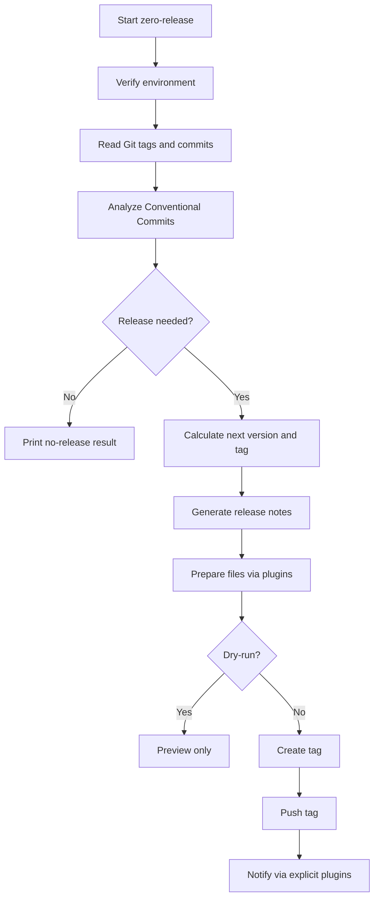
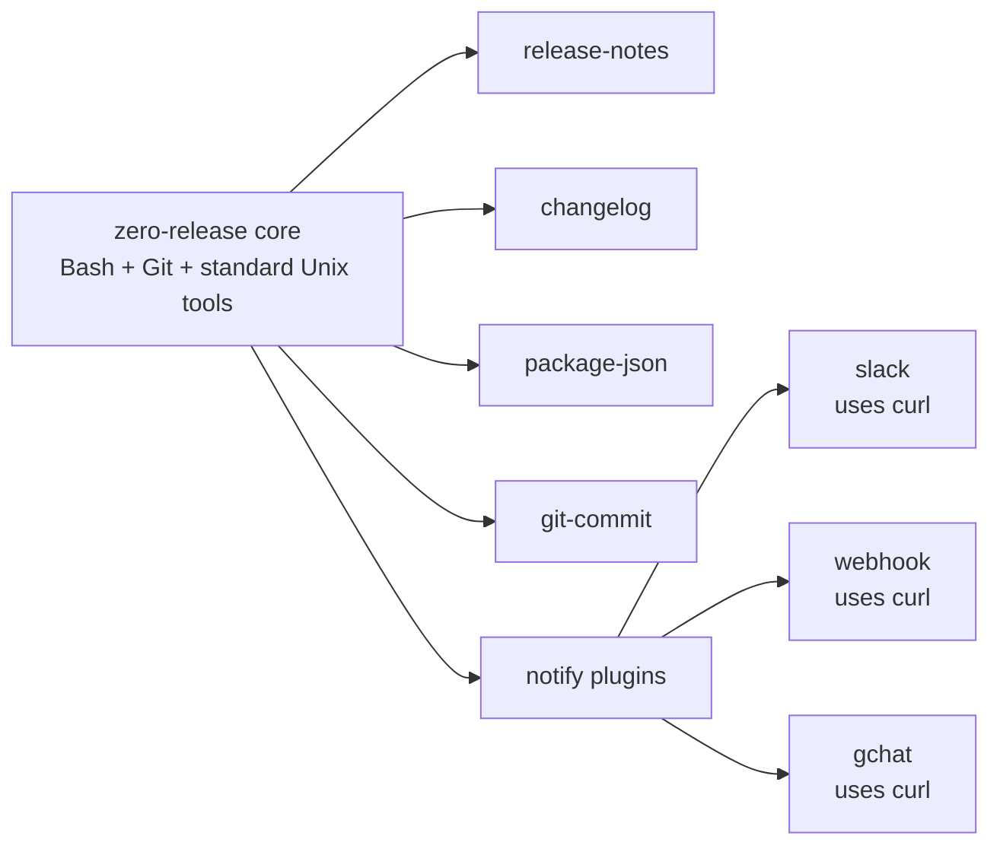

<div align="center">

# 0️⃣🚀 zero-release

**Zero-runtime-dependency semantic release automation for GitHub Actions, written in Bash and based on Conventional Commits.**

[](https://github.com/teles/zero-release/actions/workflows/tests.yml)     

</div>

`zero-release` is a zero-runtime-dependency semantic release automation tool for GitHub Actions, written in Bash and based on Conventional Commits.

It is semantic-release inspired, not semantic-release compatible. The current version intentionally does not implement `.releaserc`, `.releaserc.json`, package-manager installs, or JavaScript runtime dependencies.

## At a glance

| Area | zero-release |
|---|---|
| Runtime | Bash |
| Core dependencies | Bash, Git, and standard Unix tools |
| Commit convention | Conventional Commits |
| Configuration | CLI flags and environment variables |
| GitHub Actions | Composite action |
| Network calls | Explicit plugins only |
| `.releaserc` | Not supported |
| Compatibility | semantic-release inspired, not compatible |

## Why

`zero-release` exists for repositories that want a small release automation path in CI:

| Goal | How zero-release handles it |
|---|---|
| Reduce runtime dependencies | Bash core with no Node, jq, Python, gh, or curl |
| Avoid package-manager setup | No required package installation for the core CLI |
| Automate SemVer | Conventional Commit analysis and Git tag calculation |
| Work well in GitHub Actions | Composite action and `$GITHUB_OUTPUT` |
| Keep PRs safe | `pull_request` events default to dry-run |
| Isolate network access | Network calls only happen in explicit plugins |

This gives a smaller supply-chain surface by design: no runtime JS dependencies and no package installation required.

## Install

Use the executable directly from this repository:

```bash
./bin/zero-release --dry-run
```

Or add `bin/` to `PATH`:

```bash
export PATH="$PWD/bin:$PATH"
zero-release --dry-run
```

For GitHub Actions, prefer using the composite action shown below.

An optional compatibility wrapper exists at `bin/semantic-release`, but documentation and new workflows should use `zero-release`.

## Local Usage

```bash
zero-release
zero-release --dry-run
zero-release --json
zero-release --debug
zero-release --no-push
zero-release --no-tag
zero-release --branches main,master
zero-release --plugins release-notes,changelog,package-json
zero-release --tag-format "v%s"
zero-release --changelog-file CHANGELOG.md
zero-release --package-json package.json
zero-release --branches main --prerelease-branches alpha,beta,rc
zero-release analyze --json
zero-release doctor --json
```

Configuration is only through CLI flags and environment variables. `.releaserc` is deliberately not loaded.

## GitHub Actions

Use `actions/checkout` with full history and tags:

```yaml
- uses: actions/checkout@v4
  with:
    fetch-depth: 0

- uses: ./
  id: release
  with:
    dry-run: "false"
    plugins: "release-notes,changelog,package-json"
    branches: "main"
```

When `$GITHUB_OUTPUT` exists, the CLI writes these outputs directly:

| Output | Description |
|---|---|
| `released` | Whether a release was produced |
| `version` | The next version |
| `tag` | The next Git tag |
| `bump` | `major`, `minor`, or `patch` |
| `previous-version` | The previous version |
| `previous-tag` | The previous Git tag |
| `channel` | `stable` or the prerelease channel |

## Flags

| Flag | Default | Description |
|---|---|---|
| `--dry-run` | auto in PRs | Analyze, calculate, and preview without modifying files, creating tags, pushing, committing, or calling network plugins |
| `--json` | `false` | Print stable JSON output generated by zero-release without requiring `jq` |
| `--debug` | `false` | Print debug logs to stderr |
| `--no-push` | `false` | Create local release work but do not push |
| `--no-tag` | `false` | Do not create a tag |
| `--branches` | `main,master` | Comma-separated stable branches |
| `--plugins` | `release-notes` | Comma-separated plugins |
| `--tag-format` | `v%s` | Tag format with one `%s` placeholder |
| `--changelog-file` | `CHANGELOG.md` | Changelog file path |
| `--package-json` | `package.json` | Package file path |
| `--prerelease-branches` | empty | Comma-separated prerelease branches. Entries may be `branch` or `branch:channel` |
| `--prerelease-branch` | empty | Repeatable single prerelease branch mapping |

## Lifecycle

The CLI is structured around semantic-release-like lifecycle names:

```text
verify
analyze
verify-release
generate-notes
prepare
publish
notify
success
fail
```

Core analysis and publishing are handled by the CLI. Plugins are executable hook adapters and receive context through `ZERO_RELEASE_*` environment variables.



Plugin execution order is deterministic and based on lifecycle responsibility, not on the order passed to `--plugins`. In `prepare`, asset-changing plugins run before `git-commit`:

```text
changelog
package-json
git-commit
```

Notify plugins run in this order when enabled:

```text
webhook
slack
gchat
```

## Release Rules

Default rules:

| Commit pattern | Release type |
|---|---|
| `feat:` / `feat(scope):` | `minor` |
| `fix:` / `fix(scope):` | `patch` |
| `perf:` / `perf(scope):` | `patch` |
| `type!:` / `type(scope)!:` | `major` |
| `BREAKING CHANGE` / `BREAKING-CHANGE` | `major` |
| `chore:` / `docs:` / `test:` | no release |
| `major:` | no release by default |

Breaking changes are detected from:

```text
BREAKING CHANGE
BREAKING-CHANGE
feat!: message
feat(scope)!: message
fix!: message
fix(scope)!: message
perf!: message
perf(scope)!: message
refactor(core)!: message
```

`major:` does not create a major release by default.

## Prerelease Branches

Prereleases are opt-in. By default, `zero-release` only releases from stable branches configured with `--branches`.

To enable prereleases, configure prerelease branches explicitly:

```bash
zero-release --branches main --prerelease-branches alpha,beta,rc
zero-release --branches main --prerelease-branches alpha:alpha,next:beta
```

The prerelease identifier defaults to the branch name unless mapped. Existing prerelease tags are used to increment the number:

```text
1.3.0-alpha.1
1.3.0-alpha.2
1.3.0-beta.1
```

This is intentionally simple branch/channel prerelease support. More advanced semantic-release branch ranges and channel promotion are roadmap items.

## Plugins

Built-in plugins:

| Plugin | Lifecycle hook | Changes files? | Network? | Purpose |
|---|---|---:|---:|---|
| `release-notes` | `generate-notes` | No | No | Generates release notes |
| `changelog` | `prepare` | Yes | No | Updates `CHANGELOG.md` or `--changelog-file` |
| `package-json` | `prepare` | Yes | No | Updates the top-level `version` field in `package.json`; fails instead of modifying a nested or ambiguous field |
| `git-commit` | `prepare` | Yes | No | Commits changed release assets when explicitly enabled |
| `slack` | `notify` | No | Yes | Sends a Slack webhook notification |
| `webhook` | `notify` | No | Yes | Sends a generic webhook notification |
| `gchat` | `notify` | No | Yes | Sends a Google Chat webhook notification |

Network plugins require `curl`, are never run in `--dry-run`, and must be enabled explicitly. Webhook secrets are not required for dry-run or no-release runs, but they are required for real releases that reach `notify`.



## Publishing

Publishing is explicit:

| Action | Behavior |
|---|---|
| Create tag | Done locally unless `--no-tag` or `--dry-run` |
| Push tag | Done with `git push origin "$tag"` unless `--no-push`, `--no-tag`, or `--dry-run` |
| Push branch | Done only when the `git-commit` plugin created a release commit |
| Dry-run | Never creates commits, tags, pushes, or network calls |

## JSON Output

`--json` output is generated by Bash helpers and escaped without `jq`.

Example release:

```json
{
  "released": true,
  "previousVersion": "1.2.3",
  "nextVersion": "1.3.0",
  "previousTag": "v1.2.3",
  "nextTag": "v1.3.0",
  "bump": "minor",
  "channel": "stable",
  "dryRun": true,
  "currentBranch": "main"
}
```

## Doctor

```bash
zero-release doctor
zero-release doctor --json
```

Doctor checks Bash, Git, repository state, tag availability, branch detection, branch allowlists, remote/provider detection, plugin names, optional network plugin requirements and secrets, GitHub pull request safety, and whether dry-run would be defaulted.

Doctor does not perform release actions.

## Security

`zero-release` follows these rules:

| Rule | Why it matters |
|---|---|
| No `eval` | Avoids command injection from untrusted input |
| No project config is sourced | Avoids executing repository-provided configuration |
| No `.releaserc` support | Keeps configuration explicit through flags/env |
| No `jq` | Keeps the core free of non-standard runtime dependencies |
| No improvised JSON/YAML config parser | Avoids fragile config parsing behavior |
| No network calls in the core | Keeps network behavior isolated to explicit plugins |
| Network plugins are skipped in dry-run | Keeps PR and preview workflows safe |
| Pull request events default to dry-run | Prevents publishing from PR workflows |
| Releases only run on allowed branches | Avoids accidental releases from arbitrary branches |
| Tags, versions, branch names, and plugin names are validated | Reduces unsafe input handling |
| Commits and commit messages are treated as untrusted input | Prevents release metadata from becoming executable behavior |

## Git Providers

Remote URL helpers support common HTTPS URLs and SSH conversion such as:

```text
git@github.com:user/repo.git
https://github.com/user/repo.git
```

Compare and commit URLs are generated for GitHub, GitLab, Bitbucket, and Azure DevOps when possible.

## Current Limitations

| Limitation | Notes |
|---|---|
| No config files | No `.releaserc`, `.releaserc.json`, `.releaserc.yml`, or `package.json#release` |
| No compatibility layer | semantic-release compatibility may be explored later |
| No custom release rules | Default Conventional Commit rules only |
| No remote release plugin yet | GitHub/GitLab release creation is not implemented yet |
| Minimal `package-json` update | Updates the top-level `"version"` field using a minimal text-based strategy; complex JSON rewriting is out of scope |
| Simple prerelease support | Branch/channel prereleases are intentionally limited |

## Roadmap

- Optional config loader plugins:
  - `.releaserc`
  - `.releaserc.json`
  - `.releaserc.yml`
  - `package.json#release`
- Semantic-release compatibility layer.
- GitHub Release plugin.
- GitLab Release plugin.
- MCP server/wrapper.
- Optional Docker image for generic CI systems.
- Custom release rules.
- Custom changelog templates.

## Development

Run syntax checks:

```bash
for file in bin/zero-release bin/semantic-release lib/*.sh plugins/*/plugin; do
  bash -n "$file"
done
```

Run tests:

```bash
bats tests/unit/*.bats tests/integration/*.bats
```
