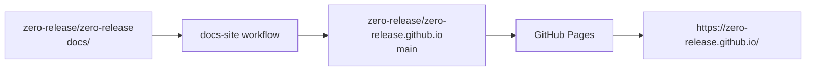

# GitHub Pages

The documentation site is designed to publish from Markdown source without committing generated HTML or JavaScript build artifacts.

GitHub Pages is the recommended host for this project because it has built-in Jekyll support. The main repository stores Markdown and `_config.yml`; GitHub Pages runs Jekyll from the generated organization site repository.



## Repository files

The source repository stores:

```text
docs/
  _config.yml
  index.md
  guide/
  plugins/
  reference/
  deployment/
```

The repository does not store:

```text
docs/_site/
```

The published repository receives the contents of `docs/` at its root, plus generated guardrail files:

```text
README.md
.gitattributes
.github/PULL_REQUEST_TEMPLATE.md
```

These files make it clear that `zero-release/zero-release.github.io` is generated and should not be edited directly.

## Source repository

In `zero-release/zero-release`, create a repository secret named `DOCS_PUBLISH_TOKEN`.

{: .warning }
Create this secret in the source repository, `zero-release/zero-release`. Do not create it only in `zero-release/zero-release.github.io`, because that repository does not run the sync workflow.

Use a fine-grained personal access token with:

| Setting | Value |
|---|---|
| Resource owner | `zero-release` |
| Repository access | Only `zero-release.github.io` |
| Contents | Read and write |
| Metadata | Read |

The workflow is `.github/workflows/docs-site.yml`. It runs on pushes to `main` when `docs/**` or the workflow itself changes. It can also be started manually from the Actions tab.

The canonical Pages site should be configured in `zero-release/zero-release.github.io`, not from the `/docs` folder of the source repository.

## Why this shape

This publishing path follows the project constraints:

| Value | Publishing choice |
|---|---|
| Keep source close to code | Documentation is edited in `zero-release/zero-release/docs` |
| Avoid a JavaScript build stack | GitHub Pages runs Jekyll from Markdown |
| Avoid generated artifacts in the main repo | The main repository stores only source Markdown |
| Keep the public site URL clean | The generated repository owns `https://zero-release.github.io/` |
| Keep automation explicit | Only the `docs-site` workflow writes to the published repository |

## Published repository

Create the repository:

```text
zero-release/zero-release.github.io
```

Use these GitHub Pages settings in that repository:

| Setting | Value |
|---|---|
| Source | Deploy from a branch |
| Branch | `main` |
| Folder | `/(root)` |

The organization site will be published at:

```text
https://zero-release.github.io/
```

The first successful workflow run creates or updates `main` in the published repository.

If the `main` branch is not available in the Pages settings yet, run the workflow once after creating the repository and then return to Settings -> Pages.

## Edit protection

The published repository is a deployment target. Treat `zero-release/zero-release` as the only source of truth.

Recommended protection for `zero-release.github.io`:

| Protection | Recommendation |
|---|---|
| Human edits | Open changes against `zero-release/zero-release/docs` instead |
| Force pushes | Block |
| Branch deletions | Block |
| Direct pushes | Restrict to the publishing token owner or a dedicated automation account |
| Pull requests | Use the generated pull request template to redirect contributors to the source repository |

If you enable a branch ruleset that blocks direct pushes to `main`, add the publishing token owner or automation account to the ruleset bypass list. Otherwise the sync workflow will be correctly configured but GitHub will reject the push.

## Theme

The docs use Just the Docs through Jekyll remote themes:

```yaml
remote_theme: just-the-docs/just-the-docs
plugins:
  - jekyll-remote-theme
```

This keeps the documentation source lightweight while still providing documentation-oriented navigation and search.

## Custom domains

If the docs later move to a custom domain, update `url` and `baseurl` in `docs/_config.yml`.

For a root custom domain such as `https://zero-release.dev`, use:

```yaml
url: "https://zero-release.dev"
baseurl: ""
```

For a subpath deployment, keep `baseurl` set to the path prefix.
