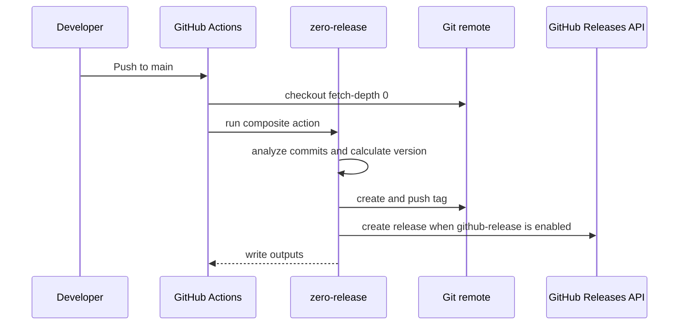

# GitHub Actions

GitHub Actions is the primary target for zero-release. Use full Git history and tags so the CLI can find previous releases and compute the next version.

## Minimal release workflow



```yaml
name: release

on:
  push:
    branches:
      - main

permissions:
  contents: write

jobs:
  release:
    runs-on: ubuntu-latest

    steps:
      - uses: actions/checkout@v4
        with:
          fetch-depth: 0

      - uses: zero-release/zero-release@v1
        id: release
        with:
          plugins: "release-notes,changelog,package-json,github-release"
          branches: "main"
```

`contents: write` allows the workflow to create and push Git tags. It also lets the `github-release` plugin create GitHub Releases when that plugin is enabled. The composite action passes the workflow `github.token` as `GITHUB_TOKEN`.

## Pinning

Use a major tag for normal usage:

```yaml
- uses: zero-release/zero-release@v1
```

Use a full version tag when you want stricter reproducibility:

```yaml
- uses: zero-release/zero-release@v1.0.0
```

## Pull request previews

On `pull_request` events, zero-release defaults to dry-run. This lets a workflow show which release would be produced without writing tags, changing files, pushing branches, or calling network plugins.

```yaml
name: release-preview

on:
  pull_request:

jobs:
  preview:
    runs-on: ubuntu-latest

    steps:
      - uses: actions/checkout@v4
        with:
          fetch-depth: 0

      - uses: zero-release/zero-release@v1
        id: release
        with:
          plugins: "release-notes,changelog,package-json,github-release"
          branches: "main"
```

## npm trusted publishing

The `npm` plugin is built for npm Trusted Publishing. It does not require or manage `NPM_TOKEN`. The npm CLI authenticates through OIDC when the package has a trusted publisher configured on npmjs.com and the workflow has `id-token: write`.

```yaml
name: release

on:
  push:
    branches:
      - main

permissions:
  contents: write
  id-token: write

jobs:
  release:
    runs-on: ubuntu-latest

    steps:
      - uses: actions/checkout@v4
        with:
          fetch-depth: 0

      - uses: actions/setup-node@v4
        with:
          node-version: "24"
          registry-url: "https://registry.npmjs.org"

      - run: npm ci
      - run: npm test
      - run: npm run build --if-present

      - run: |
          git config user.name "github-actions[bot]"
          git config user.email "41898282+github-actions[bot]@users.noreply.github.com"

      - uses: zero-release/zero-release@v1
        id: release
        with:
          plugins: "release-notes,changelog,package-json,git-commit,npm,github-release"
          branches: "main"
```

Trusted publishing currently requires npm CLI `11.5.1` or later and Node.js `22.14.0` or later. For GitHub Actions and GitLab CI/CD, npm generates provenance automatically for supported public package publishes.

## Using the action from the same repository

When developing zero-release itself, use the local action path:

```yaml
- uses: actions/checkout@v4
  with:
    fetch-depth: 0

- uses: ./
  id: release
  with:
    dry-run: "false"
    plugins: "release-notes,changelog,package-json,github-release"
    branches: "main"
```

## Outputs

When `$GITHUB_OUTPUT` exists, the CLI writes these outputs:

| Output | Description |
|---|---|
| `released` | Whether a release was produced |
| `version` | The next version |
| `tag` | The next Git tag |
| `bump` | `major`, `minor`, or `patch` |
| `previous-version` | The previous version |
| `previous-tag` | The previous Git tag |
| `channel` | `stable` or the prerelease channel |

## Common mistakes

| Symptom | Likely cause |
|---|---|
| No previous tag is detected | `actions/checkout` used the default shallow history |
| Tag push fails | Missing `contents: write` permission |
| GitHub Release fails | `github-release` is enabled without a token or repository context |
| npm publish fails | Trusted publisher or `id-token: write` is missing |

For more diagnosis paths, see [Troubleshooting]({{ site.baseurl }}/guide/troubleshooting/).
