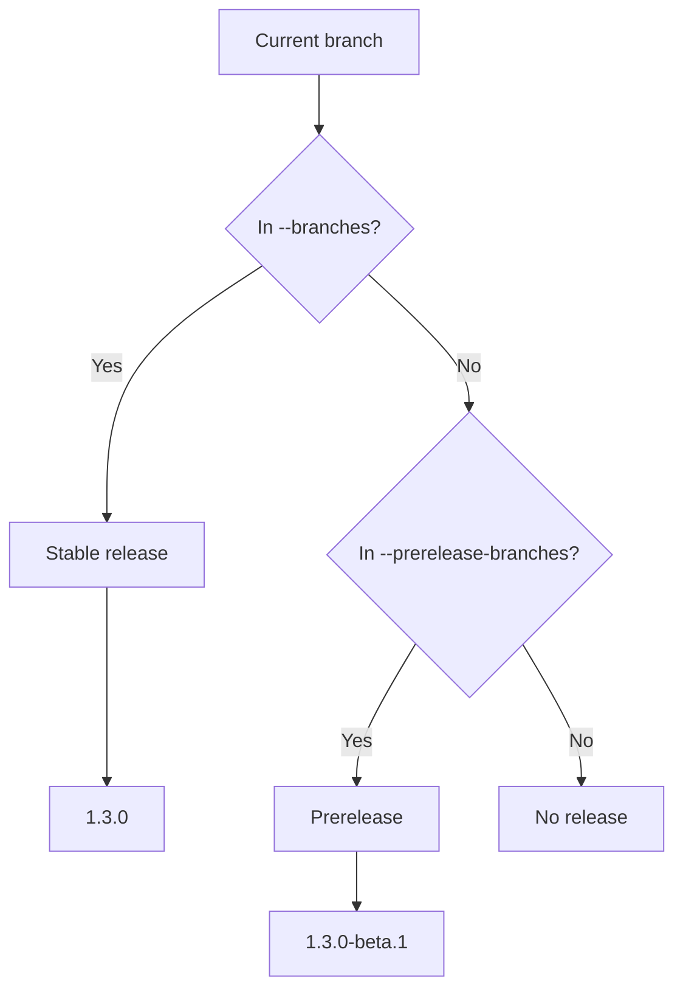

# Prereleases

Prereleases are opt-in. By default, zero-release only releases from stable branches configured with `--branches`.

## Enable prerelease branches

```bash
zero-release --branches main --prerelease-branches alpha,beta,rc
zero-release --branches main --prerelease-branches alpha:alpha,next:beta
```

In GitHub Actions:

```yaml
- uses: zero-release/zero-release@v1
  id: release
  with:
    branches: "main"
    prerelease-branches: "alpha,beta,rc,next:beta"
    plugins: "release-notes,changelog,package-json,github-release"
```

## Branch to channel mapping



Entries can be either:

| Entry | Meaning |
|---|---|
| `alpha` | Branch `alpha` publishes channel `alpha` |
| `next:beta` | Branch `next` publishes channel `beta` |

The prerelease identifier defaults to the branch name unless a channel is mapped explicitly.

## Numbering

Existing prerelease tags are used to increment the prerelease number:

```text
1.3.0-alpha.1
1.3.0-alpha.2
1.3.0-beta.1
```

For non-stable channels, the `github-release` plugin marks the GitHub Release as a prerelease. The `npm` plugin uses the channel as the npm dist-tag unless `ZERO_RELEASE_NPM_TAG` overrides it.

## Limitations

Prerelease support is intentionally simple branch/channel support. More advanced semantic-release branch ranges and channel promotion are roadmap items.
