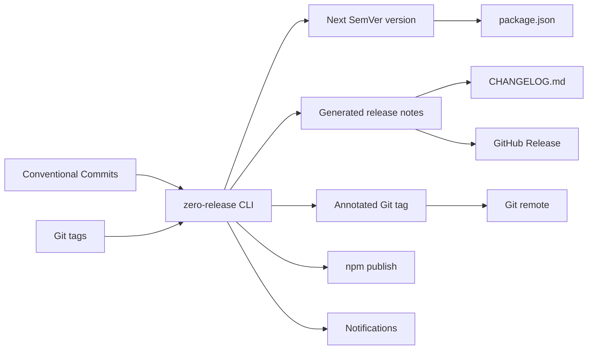

# 0️⃣🚀 zero-release

Zero-runtime-dependency semantic release automation for GitHub Actions, written in Bash and based on Conventional Commits.

`zero-release` is for projects that want semantic release automation without making the release toolchain a large runtime dependency. It is inspired by semantic-release, but it is not semantic-release compatible and intentionally does not load `.releaserc` files.

## Start here

- [Getting Started]({{ site.baseurl }}/guide/getting-started/)
- [Concepts]({{ site.baseurl }}/guide/concepts/)
- [GitHub Actions]({{ site.baseurl }}/guide/github-actions/)
- [Plugins]({{ site.baseurl }}/plugins/)
- [CLI Reference]({{ site.baseurl }}/reference/cli/)

## How it fits together



## Minimal workflow

```yaml
name: release

on:
  push:
    branches:
      - main

permissions:
  contents: write

jobs:
  release:
    runs-on: ubuntu-latest

    steps:
      - uses: actions/checkout@v4
        with:
          fetch-depth: 0

      - uses: zero-release/zero-release@v1
        with:
          plugins: "release-notes,changelog,package-json,github-release"
          branches: "main"
```

| Goal | How zero-release handles it |
|---|---|
| Reduce runtime dependencies | Bash core with no Node, jq, Python, gh, or curl |
| Avoid package-manager setup | No required package installation for the core CLI |
| Automate SemVer | Conventional Commit analysis and Git tag calculation |
| Work well in GitHub Actions | Composite action and stable workflow outputs |
| Keep PRs safe | Pull request events default to dry-run |
| Isolate network access | Network calls only happen in explicit plugins |
